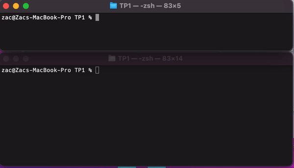
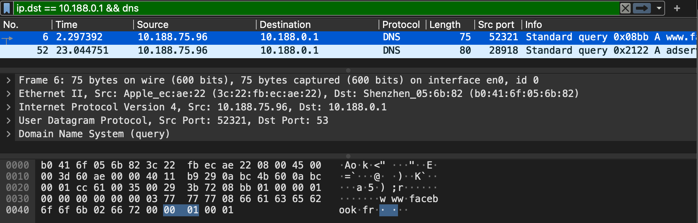

# TP Reseaux : Interrogation d’un serveur DNS 

#### Zakaria EL KHAYARI


## 1 Le protocole UDP

`git checkout d0c41be6`

- ***sendUDP*** 
    
    - Code dans le fichier : [src/sendUDP.c](src/sendUDP.c)

    - Création de l'exécutable : `make build/sendUDP`

    - Utilisation : 
        ```console    
        $ build/sendUDP <adresse_ip> <port> <msg>
        ```

- ***receiveUDP*** 
    
    - Code dans le fichier : [src/receiveUDP.c](src/receiveUDP.c)

    - Création de l'exécutable : `make build/receiveUDP`

    - Utilisation : 
        ```console    
        $ build/receiveUDP <port>
        ```

***Exemple d'utilisation :*** 

<p align="center">
  
</p>

<!--  -->

## 2 DNS : Domain Name Server

`git checkout main`

- ***sendUDP*** 
    
    - Code dans le fichier : [src/myDNS.c](src/myDNS.c)

    - Création de l'exécutable : `make build/myDNS`

    - Utilisation : 
        ```console    
        $ build/myDNS <adresse_symbolique> <ip_serveur>
        ```

    - Utilisation (serveur par défaut : 8.8.8.8): 
        ```console    
        $ build/myDNS <adresse_symbolique>
        ```

***Exemple d'utilisation :*** 

```console
$ build/myDNS www.facebook.fr 10.188.0.1
```

```
Server : 10.188.0.1
Address : 10.188.0.1#53

Non-authoritative answer:
www.facebook.fr canonical name = www.facebook.com
www.facebook.com canonical name = 	star-mini.c10r.facebook.com
Name: 	star-mini.c10r.facebook.com
Address: 157.240.21.35

Hexa answer:
08 BB 81 80 00 01 00 03 00 00 00 00 03 77 77 77 	.............www
08 66 61 63 65 62 6F 6F 6B 02 66 72 00 00 01 00 	.facebook.fr....
01 C0 0C 00 05 00 01 00 00 02 D7 00 12 03 77 77 	..............ww
77 08 66 61 63 65 62 6F 6F 6B 03 63 6F 6D 00 C0 	w.facebook.com..
2D 00 05 00 01 00 00 08 DB 00 1D 09 73 74 61 72 	-...........star
2D 6D 69 6E 69 04 63 31 30 72 08 66 61 63 65 62 	-mini.c10r.faceb
6F 6F 6B 03 63 6F 6D 00 C0 4B 00 01 00 01 00 00 	ook.com..K......
00 CA 00 04 9D F0 15 23                         	.......#

```

**Paquet capturé avec Wireshark:**


